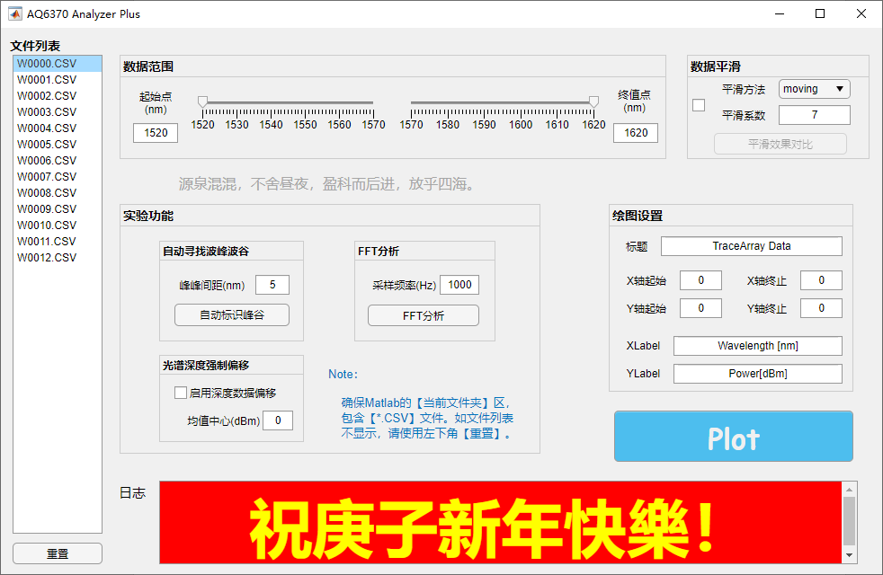
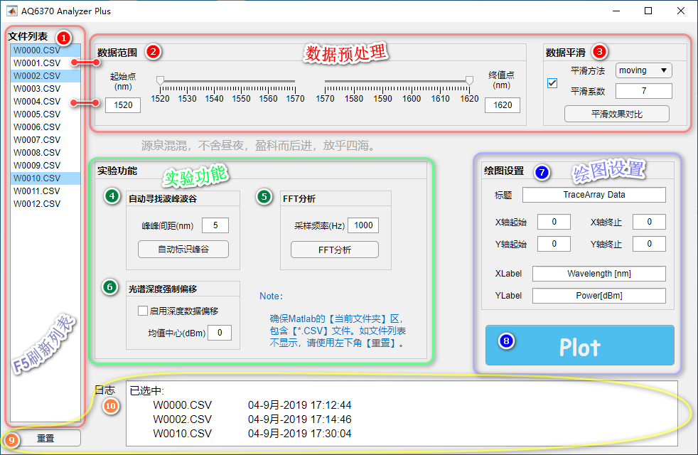
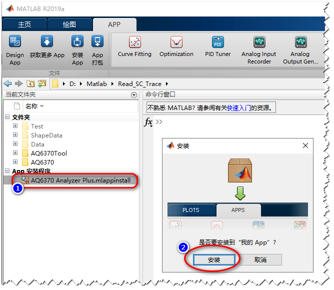
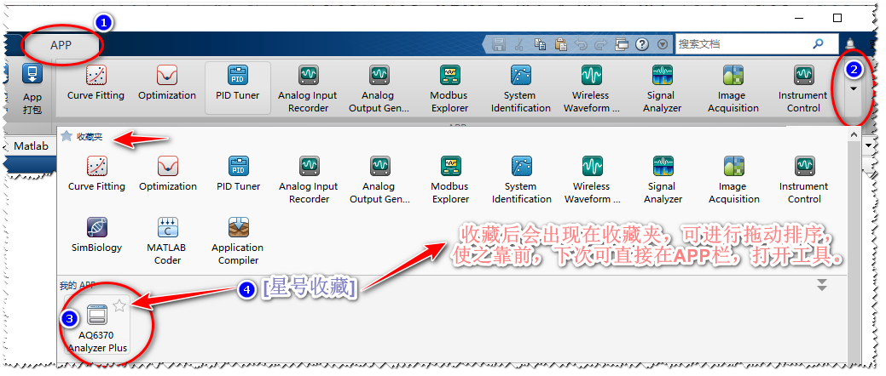
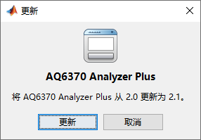
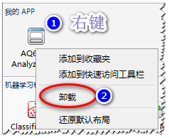
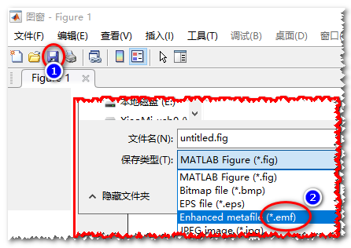

**文件快速下载：**  

- 使用说明：<https://www.lanzous.com/i8u8myh>  &emsp;或&emsp;  <http://me.cjxu.cc/doc/AQ6370.pdf>

- 工具箱安装包：<https://www.lanzous.com/i8u8ouf>

- 工具箱开源版本：<https://www.lanzous.com/i8u8naj>  

**++++++++++++++++++++++++++++++++++++++++++++++++++++++++++++++++++++++++++**

**
AQ6370光谱仪光谱数据分析工具使用说明
**

**++++++++++++++++++++++++++++++++++++++++++++++++++++++++++++++++++++++++++**

**写在前面：**

相比与之前的脚本函数，此次新年版本带来如下改进：

1.  全部开源，随需任意修改

2.  一键安装，无需任何设置

3.  点按操作，无需任何指令

4.  工具与文件彻底分离，数据存放在U盘也可直接分析

5.  集成游标的NewCallback函数，无需进行选择修改

6.  绘图自动开启绘图编辑器，无需手动打开

7.  绘图自动开启放大模式，直接选定区域

8.  添加数据范围定义

9.  添加多种数据平滑方式

10. 添加数据平滑效果对比

11. 添加FFT分析

12. 添加深度数据自动偏移（针对只分析波长漂移）

13. 添加绘图窗口自定义设置（X/Y轴范围、X/Y轴Label、标题）

>   **Note**：

1.  工具编写环境为Matlab R2019a版本，建议使用不低于R2019a版本。

2.  使用时，需将Matlab的[**当前文件夹**]切换到数据文件所在文件夹。

**1.功能介绍**

**================================数据预处理=================================**

**1.1 文件列表**

>&emsp; APP启动是会自动列出当前文件夹下的所有【\*.CSV】文件，并输出在文件列表里。同时会读取数据文件以确定数据范围的起始及限制范围。  
&emsp; 在文件列表下，可对文件进行单选、多选，选中的文件会在日志中显示出来。  
+ 任意多选  
  &emsp; 按住Ctrl，可进行任意多选。  
+ 顺序多选   
  &emsp; 选中一个文件，按住Shift，再选中另一个文件，则两个文件之间所有文件将被选中。  
+ 刷新文件列表  
  &emsp; 单击窗口任意*空白位置*，按F5即可刷新文件列表。或者使用重置，重置之后数据范围、数据平滑、绘图设置都将恢复默认。

**1.2 数据范围**

>&emsp;可通过滑块选择数据的起始点和终值点，也可在下面文本框中进行精确输入。另外，滑块只支持从两侧向中间靠，如果想只读1520-1540nm的数据，则将终值点输入为1540即可。

**1.3 数据平滑**

>&emsp;数据平滑调用的是Matlab中自带的smooth函数，涉及到的平滑方法，平滑系数都是smooth函数的方法和系数。具体请参照：<https://ww2.mathworks.cn/help/curvefit/smooth.html?searchHighlight=smooth&s_tid=doc_srchtitle>

**1.4 平滑效果对比**

>&emsp;勾选数据平滑，才可使用。平滑效果对比会将原始数据和平滑后的数据同时绘出，其中*虚线*为原始数据。如果选中的文件为多个文件，则对比的其中的第一个文件。

Note：

>   这部分是对数据的预处理，之后的FFT，自动寻找波峰波谷，绘图全都是调用预处理之后的数据。

**=================================实验功能=================================**

**1.5 自动寻找波峰波谷**

>&emsp;自动寻找波峰波谷，使用了Matlab中findpeaks函数，其中的峰峰间距已经转换为nm为单位，波峰波谷的寻找建议开启数据平滑。注意：开启平滑之后，数据并不是原始数据，请注意进行平滑对比，以确定具体效果。

**1.6 FFT分析**

>&emsp;FFT分析程序部分，需要确定具体的采样率，使用时*务必*确认该部分FFT部分程序，必要时请自行修改。

**1.7 光谱深度强制偏移**

>&emsp;该选项针对同一传感器，在两次单模光纤熔接是时产生损耗不同而造成的光谱深度不同，在同一张图中无法对比的情况，可将整张光谱图的平均深度偏移到同一深度，便于对比波长的漂移。均值中心即偏移到的深度值，默认是0dbm。

**===================================绘图===================================**

**1.8 绘图设置**

>&emsp;可对数轴Label、标题、数轴范围进行设置，不修改则为默认。

**1.9 绘图**

>&emsp;一键绘图，默认自动开启绘图编辑器，默认自动最大化，默认自动打开放大模式。

**===================================其他===================================**

**1.10 重置**

>&emsp;将所有设置，恢复至刚打开状态，同时会重新扫描当前文件夹中的文件。

>&emsp;如果仅是刷新当前目录下文件，请按F5

**1.11 日志**

>&emsp;输出相关文件信息及错误提示。

**2.安装、使用、更新、卸载**

**2.1安装**

&emsp;在Matlab中，双击①AQ6370 Analyzer
Plus.mlappinstall进行安装，选②安装即可。安装完即可删除，无需保留。

**2.2使用**

&emsp;在菜单栏 选①APP，点最右侧②下拉箭头，在弹出APP列表中，选择③AQ6370 Analyzer
Plus即可。可将APP④添加收藏，并拖动排序，使之靠前，下次使用时，选①APP就能直接看到。

**2.3更新**

&emsp;提供新版本APP后，重复【1.安装】的步骤，选择更新即可。

**2.4卸载**

&emsp;找到工具后，①右键，选择②卸载即可。

**3.线图保存**

&emsp;推荐保存为emf格式（矢量图）。使用时，直接将[\*.emf]文件拖入word即可。

**4.下载地址**

>   Github：<https://github.com/cxeo/AQ6370-Analyzer-Plus>

>   使用说明：<http://me.cjxu.cc/doc/AQ6370.pdf>
